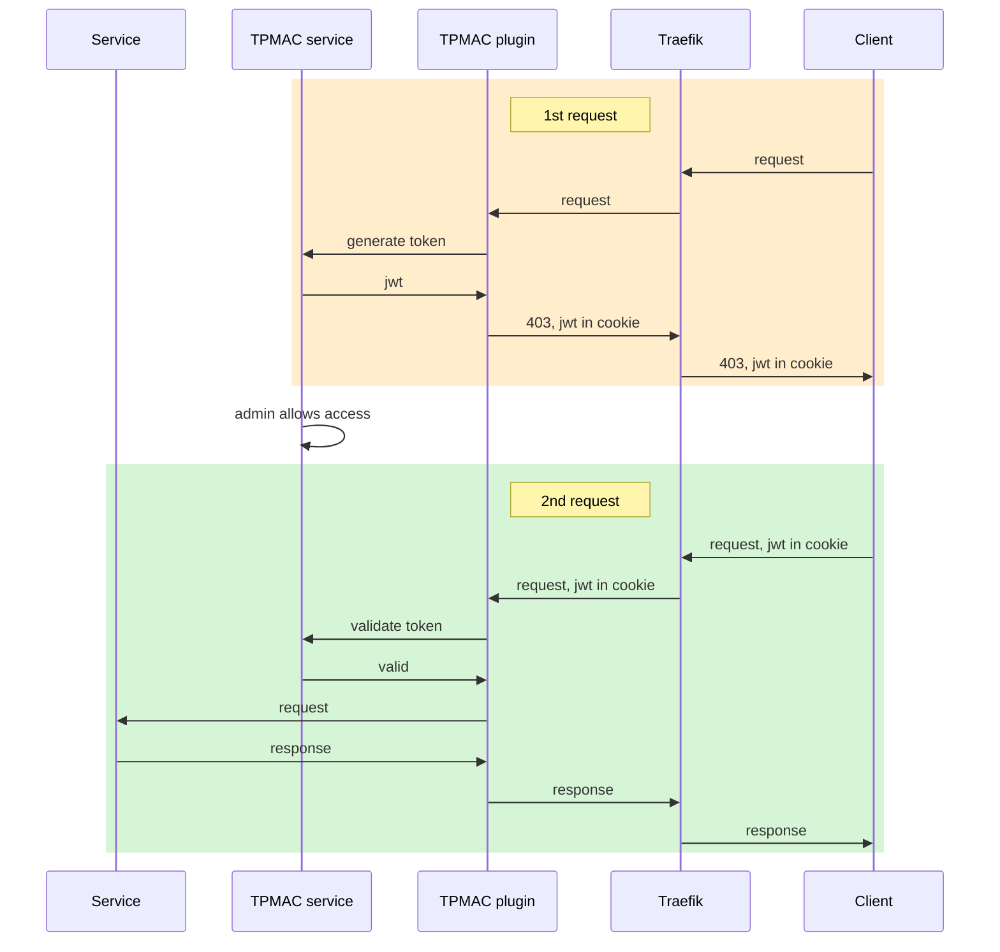

# traefik-plugin-manual-access-control

traefik-plugin-manual-access-control(TPMAC) is a traefik plugin that provides manual access control for services behind traefik.

# Features

- [x] manual access control
- [x] visualization of access logs
- [ ] persistent data
- [ ] rule based auto access control


# Setup

## 1. Setup TPMAC service

First, run TPMAC service, below is an example with docker compose, and assuming `tpmac.home.your-domain.com` is the domain you want to use.

```
version: '3'

services:
  traefik-plugin-manual-access-control:
    image: ghcr.io/iloahz/traefik-plugin-manual-access-control:main
    restart: always
    environment:
      - IP2LOCATION_API_KEY=some_key_1
      - JWT_SECRET=some_key_2
    networks:
      - traefik-network
    labels:
      - traefik.enable=true
      - traefik.http.routers.tpmac.rule=Host(`tpmac.home.your-domain.com`)
      - traefik.http.routers.tpmac.tls=true
      - traefik.http.routers.tpmac.tls.certresolver=letsencrypt-cloudflare

networks:
  traefik-network:
    external: true
```

### 1.1 How to get IP2LOCATION_API_KEY

You can get free api key from https://www.ip2location.io/

### 1.2 How to get JWT_SECRET

```
openssl rand -base64 32
```

you will get something like

```
z8fXgwQIc/wT2zs4ct5C8RCFJ1lxrSwIxjTLvJP3yuI=
```

## 2. Enable TPMAC in traefik

Add the following to `traefik.yml` and restart traefik.

```
experimental:
  plugins:
    traefik-plugin-manual-access-control:
      moduleName: github.com/iloahz/traefik-plugin-manual-access-control
      version: v0.1.7
```

## 3. Use TPMAC on the services behind traefik

You can follow the instructions on [traefik plugin](https://plugins.traefik.io/plugins/648fb6ac498e334469bdbd24/manual-access-control) page.

If you are using traefik with docker compose labels, an example would be:

```
labels:
    - traefik.http.middlewares.my-traefik-plugin-manual-access-control.plugin.traefik-plugin-manual-access-control.Server=https://tpmac.home.your-domain.com
    - traefik.http.routers.chatgpt-next-web.middlewares=my-traefik-plugin-manual-access-control
```

## 4. Verify

This step is optional.

When step #2 is successful, you should see TPMAC plugin enabled in traefik http middlewares page.


# How it works
TPMAC uses JWT in cookie to control access, jwt is used to identify client only, consent is managed in TPMAC service.



Access control is "who can access what", compared to the comprehensive model of [AWS IAM](https://aws.amazon.com/iam/), TPMAC uses a simplified model to make it more convenient for homelab users.

## "Who" in TPMAC

In common sense, "who" is one particular friend, but how do we identify this user could be tricky, especially when we want to avoid complicated configs for homelab admin and authentication for friends.

A proxy of "who" is the device that the user is using, but unfortunately, it's not easy to identify a device, at least not in http layer, and since we want to build a general solution that works for all services, modifying the service is not an option.

Identifying "who" is the most important part of access control, TPMAC uses JWT to identify "who", and the JWT is stored in cookie.

## "What" in TPMAC

"What" is very simple in TPMAC, it's a service behind traefik, and identified by the `host` only.

## "Consent" in TPMAC

TBA

# Credits

* Thanks to [ip2location.io](https://www.ip2location.io/)
* Thanks to [mapbox](https://www.mapbox.com/)